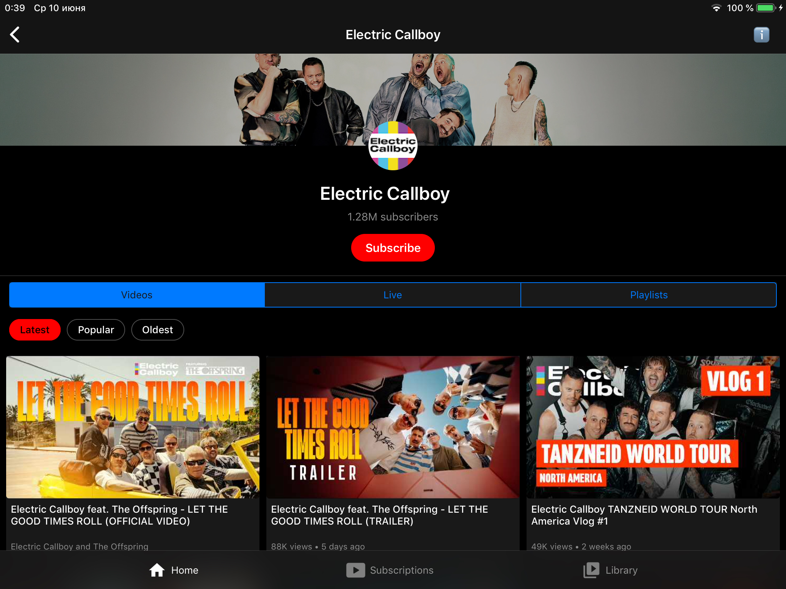
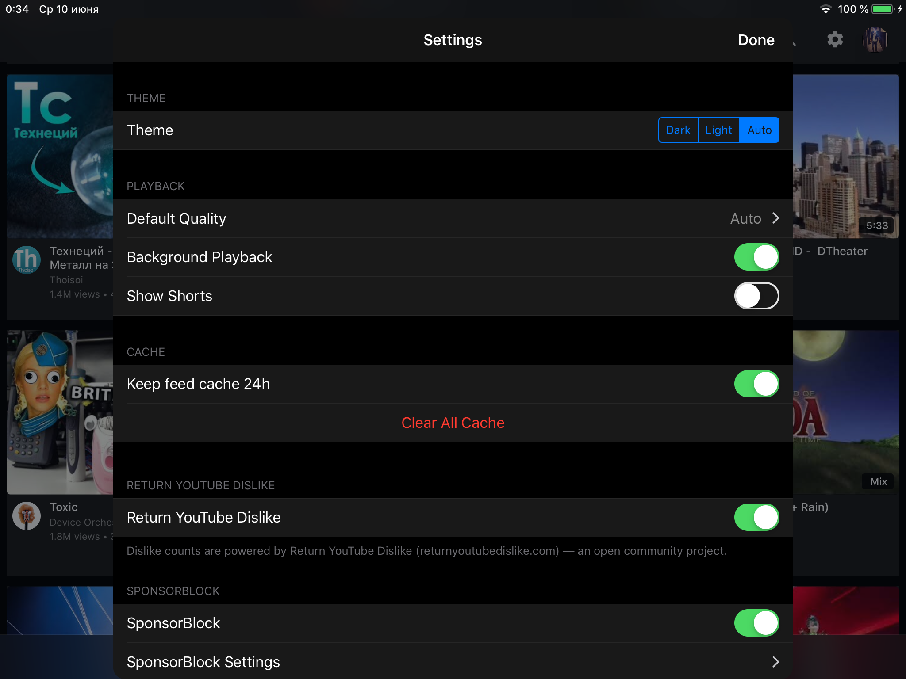

# YTLite

A lightweight, privacy-focused YouTube client for iOS 12+ built entirely with UIKit. No ads, no tracking, no dependencies.

<p align="center">
  
</p>

## Features

- **Video Playback** — up to 1080p 60fps quality
- **Background Audio** — Continue listening with the screen off
- **Picture-in-Picture** — Watch while using other apps
- **SponsorBlock** — Skip sponsored segments automatically 
- **Return YouTube Dislike** — See dislike counts again
- **Subtitles** — Full subtitle/caption support with VTT parsing
- **Search & Browse** — Home feed, trending, channel pages, playlists
- **Subscriptions** — Follow channels with a local subscription feed
- **Watch History** — Track what you've watched with progress indicators
- **Autoplay** — Automatically play the next related video
- **Dark/Light Theme** — Manual theme switching via ThemeManager
- **Download** — Save videos for offline viewing (planned)

<p align="center">
  
</p>

## Requirements

- iOS 12.0+
- Xcode 16+
- No external dependencies (no CocoaPods, no SPM packages)

## Building

```bash
git clone https://github.com/verback2308/YTLite.git
cd YTLite
open YTLite.xcodeproj
```

Select the **YTVLite** scheme, choose your device or simulator, and build (⌘B).

### IPA for sideloading

```bash
./make_ipa.sh
```

Produces a self-signed IPA installable via AltStore, TrollStore, or Filza (jailbroken).

## Architecture

```
YTLite/
├── API/              YouTube Innertube API client
├── Auth/             OAuth device-code flow
├── Common/           Shared UI components & utilities
├── Config/           URLs, UserDefaults keys, constants
├── Extensions/       Swift extensions
├── Features/
│   ├── Channel/      Channel page with tabs
│   ├── Home/         Home feed
│   ├── Library/      Playlists & saved videos
│   ├── Player/       Video player & watch page
│   ├── Profile/      User profile
│   ├── Search/       Search with suggestions
│   └── Subscriptions/ Subscription feed
└── Services/         Business logic & playback
```

### Key Design Decisions

- **Zero external dependencies** — Networking via `URLSession`, images via custom `ThumbnailImageView`, playback via `AVPlayer`
- **All UIKit, no SwiftUI** — Programmatic layout, no storyboards
- **iOS 12+ support** — No SF Symbols, no SwiftUI, no Combine
- **Manual JSON parsing** — `JSONSerialization` + dictionary traversal for YouTube Innertube API responses
- **Dependency injection** — `ServiceContainer` provides services; view controllers receive dependencies via initializers

### Playback Pipeline

The app fetches video streams via YouTube's Innertube API. Two strategies are used in practice:

1. **Generated HLS** — Adaptive formats (360p–1080p) are converted from DASH SIDX byte ranges into an HLS playlist for native `AVPlayer`. This is the primary path with quality selection.
2. **Progressive** — Direct 360p MP4 URL as a fallback when YouTube restricts adaptive formats (e.g. during server-side A/B experiments).

If streams are unavailable from the primary client, an **Onesie** fallback requests them through YouTube's proprietary bootstrap API.

### Authentication

OAuth device-code flow: the app requests a device code → user enters it at google.com/device → tokens are stored in Keychain. Anonymous browsing is supported.

## Project Structure

| Component | Purpose |
|-----------|---------|
| `InnertubeClient` | YouTube API: browse, search, player, comments, subscriptions |
| `PlaybackFacade` | Orchestrates playback strategy selection and player setup |
| `VideoPlayerView` | Custom player UI with controls, gestures, PiP |
| `WatchViewController` | Watch page: player + metadata + comments + related |
| `AppCache` | Dual-layer cache (memory + disk) with TTL |
| `SponsorBlockController` | SponsorBlock API integration |
| `ThemeManager` | App-wide theming (dark/light) |

## Contributing

1. Fork the repository
2. Create a feature branch (`git checkout -b feature/my-feature`)
3. Commit your changes (`git commit -am 'Add my feature'`)
4. Push to the branch (`git push origin feature/my-feature`)
5. Open a Pull Request

Please follow the existing code style. SwiftLint is configured and runs as a build phase.

## Bug Reports

If you encounter a bug, you can export debug logs directly from the app:

**Settings → Debug → Share Debug Log**

This generates a log file you can attach to your GitHub issue. The log includes timestamped playback, API, and caching events that help diagnose problems.

## Credits

- [SponsorBlock](https://github.com/ajayyy/SponsorBlock) — crowdsourced API for skipping sponsored segments
- [Return YouTube Dislike](https://github.com/Anarios/return-youtube-dislike) — community-maintained dislike count data
- [yt-dlp](https://github.com/yt-dlp/yt-dlp) — invaluable reference for understanding YouTube's playback infrastructure

## Legal

This project is for educational and personal use. It is not affiliated with, endorsed by, or connected to Google or YouTube. Use at your own risk.

## License

MIT
